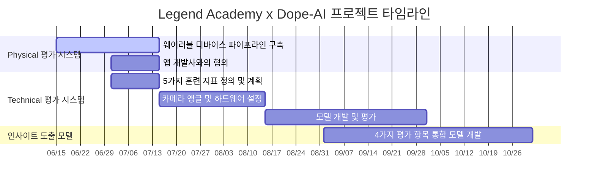

# 🏆 Legend Academy x Dope-AI 프로젝트 계획서

> **한국 축구 선수를 위한 AI 기반 평가 시스템 개발**  
> 유럽 트레이드 시장 진출을 위한 신뢰성 있는 선수 데이터 분석 솔루션

---

## 📋 프로젝트 개요

**Legend Academy** 가 주도하는 이 프로젝트에서 **Dope-AI**는 Legend Academy의 **'4 Corner' 이론**을 기반으로 한 선수 평가 시스템을 개발하는 핵심 AI 파트너 역할을 수행한다.

### 🎯 핵심 목표
- 정량적 데이터 생성 및 분석을 통한 객관적 선수 평가
- 유럽 시장에서 경쟁력 있는 선수 보고서 제공
- '4 Corner' 이론 기반 종합적 선수 분석 시스템 구축

### 🧭 4 Corner 평가 체계

```
┌─────────────────┬─────────────────┐
│   📊 Physical   │   ⚽ Technical  │
│                 │                 │
│ • 체력 지표     │ • 패스         │
│ • 속도 측정     │ • 슈팅         │
│ • 지구력 평가   │ • 방향전환     │
│                 │ • 볼 컨트롤    │
│                 │ • 드리블       │
├─────────────────┼─────────────────┤
│   🧠 Mental     │   👥 Social     │
│                 │                 │
│ • 집중력        │ • 팀워크       │
│ • 압박 상황 대응│ • 리더십       │
│ • 경기 이해도   │ • 커뮤니케이션 │
└─────────────────┴─────────────────┘
```

---

## 🔧 Dope-AI 역할 및 책임사항

> ⚠️ **중요**: 본 문서에 명시되지 않은 사항은 Dope-AI의 책임 범위에 포함되지 않는다.

### ✅ 담당 업무
1. **Physical 평가**를 위한 웨어러블 디바이스 기반 데이터 수집 파이프라인 구축
2. **Technical 평가**를 위한 5가지 훈련 지표 측정 모델 개발
3. **4 Corner 통합** 인사이트 도출 모델 개발$$

### ❌ 범위 외 업무
- Social 및 Mental 평가의 데이터 수집 및 평가 방법 정의
- 협업 앱 개발사와의 최종 앱 개발 및 배포
- 훈련 프로그램 설계 및 운영
- 유럽 선수 트레이드 시장에 대한 마케팅 또는 영업 활동

---

## 📊 세부 작업 계획

### 1️⃣ Physical 평가 시스템 개발

#### 1.1 웨어러블 디바이스 데이터 수집 파이프라인 구축

**🎯 목표**: 선수들의 신체적 성과를 정량적으로 측정하기 위한 데이터 수집 시스템 구축

**📋 세부 작업**:
- [ ] 웨어러블 디바이스 선정 및 데이터 수집 프로토콜 정의
- [ ] 데이터 전송 및 저장 인프라 설계
- [ ] 데이터 분석을 위한 초기 파이프라인 개발

#### 1.2 협업 앱 개발사와의 협의

**🎯 목표**: 데이터 처리에 대한 역할 및 책임(R&R) 정의

**📋 세부 작업**:
- [ ] 앱 개발사와 미팅을 통해 데이터 처리 워크플로우 협의
- [ ] 코치진과 협력하여 데이터 처리 요구사항 수집
- [ ] R&R 문서화 및 공유

> 💡 **참고**: 데이터 처리의 구체적인 실행은 앱 개발사와 협의 후 결정되며, Dope-AI는 데이터 수집 및 초기 처리에 집중합니다.

---

### 2️⃣ Technical 평가 시스템 개발

#### 2.1 5가지 훈련 지표 정의 및 데이터 수집 계획

**🎯 목표**: 패스, 슈팅, 방향전환, 볼 컨트롤, 드리블에 대한 세부 지표 수립

**📋 세부 작업**:
- [ ] 각 지표의 측정 기준 및 방법론 정의
- [ ] 데이터 수집을 위한 훈련 세션 설계
- [ ] 필요한 하드웨어(카메라, 센서 등) 선정 및 배치 계획

#### 2.2 카메라 앵글 및 하드웨어 설정

**🎯 목표**: 선수 움직임을 최적으로 포착할 수 있는 카메라 앵글 지정

**📋 세부 작업**:
- [ ] 훈련장 내 카메라 설치 위치 및 앵글 결정
- [ ] 하드웨어 설치 및 테스트
- [ ] Dope-AI의 기본 동작 측정 소프트웨어 적용 및 시험

#### 2.3 모델 개발 및 평가

**🎯 목표**: 5가지 지표를 정량적으로 평가하는 AI 모델 개발

**📋 세부 작업**:
- [ ] 초기 모델 트레이닝 및 성능 평가
- [ ] 필요 시 fine-tuning 수행
- [ ] 모델 출력(선수별 5가지 지표 점수)을 앱 개발사 서버로 전송하는 시스템 구축

---

### 3️⃣ 인사이트 도출 모델 개발

#### 3.1 4가지 평가 항목 통합

**🎯 목표**: Physical, Social, Mental, Technical 평가를 종합하여 인사이트 도출

**📋 세부 작업**:
- [ ] 각 평가 항목의 데이터 통합 방안 설계
- [ ] 인사이트 도출을 위한 알고리즘 개발
- [ ] 모델 성능 평가 및 최적화

> 💡 **참고**: Social 및 Mental 평가는 코치의 정성적 데이터로 제공되며, Dope-AI는 이를 통합하여 인사이트를 생성합니다.

---

## 📅 프로젝트 타임라인

### 전체 프로젝트 기간
**2025년 6월 15일 ~ 2025년 11월 1일** (약 4.5개월)

### 📊 Gantt Chart



### 📈 상세 일정표

| 작업 항목 | 시작일 | 종료일 | 소요 기간 | 진행률 |
|-----------|--------|--------|-----------|---------|
| **1. Physical 평가 시스템 개발** | 2025-06-15 | 2025-08-15 | 2개월 | 📊 |
| 1.1 웨어러블 디바이스 파이프라인 구축 | 2025-06-15 | 2025-07-15 | 1개월 | ⏳ |
| 1.2 협업 앱 개발사와의 협의 | 2025-07-01 | 2025-07-15 | 2주 | ⏳ |
| **2. Technical 평가 시스템 개발** | 2025-07-01 | 2025-10-01 | 3개월 | 📊 |
| 2.1 5가지 훈련 지표 정의 및 계획 | 2025-07-01 | 2025-07-15 | 2주 | ⏳ |
| 2.2 카메라 앵글 및 하드웨어 설정 | 2025-07-15 | 2025-08-15 | 1개월 | ⏳ |
| 2.3 모델 개발 및 평가 | 2025-08-15 | 2025-10-01 | 1.5개월 | ⏳ |
| **3. 인사이트 도출 모델 개발** | 2025-09-01 | 2025-11-01 | 2개월 | 📊 |
| 3.1 4가지 평가 항목 통합 모델 개발 | 2025-09-01 | 2025-11-01 | 2개월 | ⏳ |

---

## 💡 기대 성과 및 결과물

### 🎯 최종 결과물
1. **Physical 평가 대시보드**
   - 실시간 웨어러블 데이터 모니터링
   - 선수별 체력 지표 분석 리포트

2. **Technical 평가 AI 모델**
   - 5가지 기술 지표 자동 평가 시스템
   - 선수별 강점/약점 분석 도구

3. **통합 인사이트 플랫폼**
   - 4 Corner 종합 평가 시스템
   - 유럽 이적 시장 대비 경쟁력 분석

### 📊 성공 지표 (KPI)
- 데이터 수집 정확도: **95% 이상**
- 모델 예측 정확도: **90% 이상**
- 시스템 응답 속도: **< 2초**
- 코치 만족도: **4.5/5.0 이상**

---

## 🤝 협업 체계

### 👥 핵심 이해관계자

| 역할 | 담당자 | 책임사항 |
|------|--------|----------|
| **프로젝트 리드** | Dope-AI | 전체 기술 개발 및 시스템 통합 |
| **도메인 전문가** | Legend Academy 코치진 | 선수 평가 기준 정의 및 검증 |
| **앱 개발** | 협업 앱 개발사 | UI/UX 및 최종 사용자 앱 구현 |
| **데이터 관리** | 공동 협의 | 데이터 처리 및 저장 체계 운영 |

### 🔄 커뮤니케이션 계획
- **주간 진행 보고**: 매주 금요일 오후 2시
- **월간 마일스톤 리뷰**: 매월 마지막 주 목요일
- **긴급 이슈 대응**: 24시간 내 대응 체계

---

## 🚀 결론

**Dope-AI**는 **Legend Academy**와 협력하여 한국 시장의 특성과 유럽 선수 트레이드 요구사항을 충족하는 **혁신적인 AI 기반 평가 시스템**을 개발합니다. 

본 계획서는 Dope-AI의 역할을 명확히 정의하고, 프로젝트 성공을 위한 구체적인 로드맵을 제공합니다. 이를 통해 Legend Academy는 **객관적이고 신뢰할 수 있는 선수 데이터**를 기반으로 유럽 시장에서 경쟁력을 확보할 수 있을 것입니다.

### 🎯 프로젝트 성공의 핵심
1. **정량적 데이터 기반** 객관적 선수 평가
2. **4 Corner 이론 통합**을 통한 종합적 분석
3. **유럽 시장 표준**에 부합하는 신뢰성 있는 리포트
4. **지속가능한 AI 모델**을 통한 장기적 가치 창출

---

*📧 문의사항이나 추가 정보가 필요하시면 언제든 연락 주시기 바랍니다.*

**프로젝트 시작일**: 2025년 6월 15일  
**예상 완료일**: 2025년 11월 1일  
**총 소요 기간**: 4.5개월
